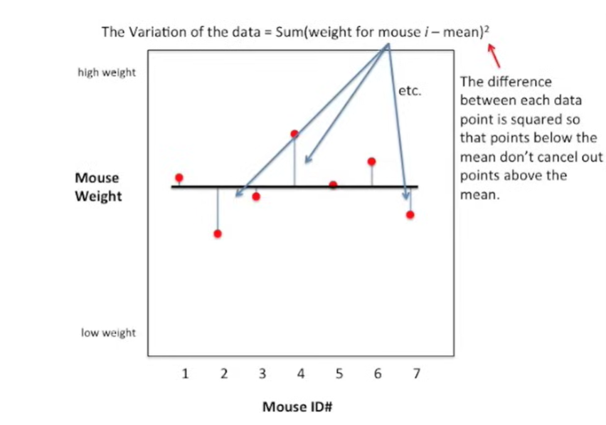

# R² - R_square

We all know about correlation (regular "R") , 
correlation values close to 1 or -1 are good and tell you two that two quantitative variables are correlated

for example
weight and size are strongly related.

Correlation values close to zero are lame.

__R-squared__ is very similar to its hipper cousin ' __R__', but interpretation is easier.

For example it's not __obvious__ that when '__R__' equals 0.7 that's twice as good a correlation as when '__R__' equals 0.5.

However __R-squared__ equals to 0.7 is what it looks like it's 1.4 times as good as __R-squared__ equals 0.5. 

The other thing about __R-squared__ is that it's easy and intuitive to calculate.

Given that we know an individual Mouse's size, what is  the
best way to predict that individual Mouse's weight? 

#### R² =  [ VAR(mean) - VAR( best_fit_line) ] / VAR( mean)

Given that formula what is variance ?

#### Variance is a statistical measure that tells us how spread out the values in a dataset are from the mean (average) of the dataset.

$$
s^2 = \frac{1}{n - 1} \sum_{i=1}^{n} (x_i - \bar{x})^2
$$

