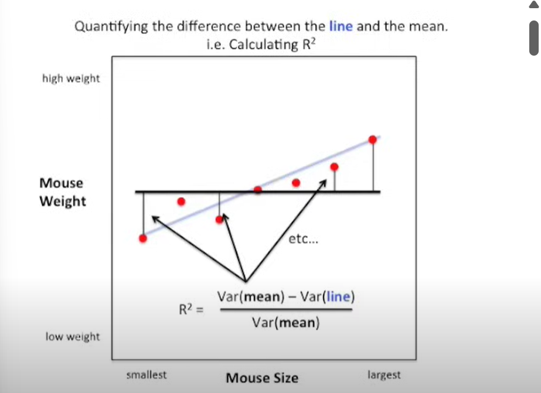

# R² - R_square

We all know about correlation (regular "R") , 
correlation values close to 1 or -1 are good and tell you two that two quantitative variables are correlated

for example
weight and size are strongly related.

Correlation values close to zero are lame.

__R-squared__ is very similar to its hipper cousin ' __R__', but interpretation is easier.

For example it's not __obvious__ that when '__R__' equals 0.7 that's twice as good a correlation as when '__R__' equals 0.5.

However __R-squared__ equals to 0.7 is what it looks like it's 1.4 times as good as __R-squared__ equals 0.5. 

The other thing about __R-squared__ is that it's easy and intuitive to calculate.

Given that we know an individual Mouse's size, what is  the
best way to predict that individual Mouse's weight? 

                                                   R² =  [ VAR(mean) - VAR( best-fit-line) ] / VAR( mean)

# Variance and Residuals

#### Variance is a statistical measure that tells us how spread out the values in a dataset are from the mean (average) of the dataset.

The 2 types of variance are:

The **population variance** $$\( \sigma^2 \)$$ is defined as:

$$
\
\sigma^2 = \frac{1}{N} \sum_{i=1}^{N} (y_i - \mu)^2
\
$$

The **sample variance** $$\( s^2 \)$$ is calculated as:

$$
\
s^2 = \frac{1}{n - 1} \sum_{i=1}^{n} (y_i - \bar{y})^2
\
$$

SO, here we will the formula for sample data  

$$
s^2 = \frac{1}{n - 1} \sum_{i=1}^{n} (y_i - \bar{y})^2
$$

assume values of x and y to be 

                         x = [ 0.9 , 1.7 , 2.2 , 3.5 , 4.7 , 5.2 , 5.3 , 5.8 , 6.2 ]                         

                         y = [ 1.3 , 2.4 , 0.9 , 3.4 , 3.2 , 2.8 , 5.5 , 4.7 , 6.0 ]

              
suppose the x-values to be the weight of individuals and y-values to be height                        

first we will calculate the mean 

$$Sum = 1.3 + 2.4 + 0.9 + 3.4 + 3.2 + 2.8 + 5.5 + 4.7 + 6.0 = 30.2$$

$$ n = 9$$

$$Mean = 30.2 / 9 ≈ 3.36$$ 

  
The red point is the actual data point $$(yᵢ)$$  and the point where the dotted line meets the horizontal line ( mean line )  is the mean $$(ȳ)$$ and the difference between them is called as residual.

## Squared Deviations Table

We'll compute each $$\ (y_i - \bar{y})^2 \$$:

| $$\( y_i \)$$ | $$\( y_i - \bar{y} \)$$ | $$\ (y_i - \bar{y})^2 \$$ |
|----------:|--------------------:|------------------------:|
| 1.3       | -2.06               | 4.2436                  |
| 2.4       | -0.96               | 0.9216                  |
| 0.9       | -2.46               | 6.0516                  |
| 3.4       |  0.04               | 0.0016                  |
| 3.2       | -0.16               | 0.0256                  |
| 2.8       | -0.56               | 0.3136                  |
| 5.5       |  2.14               | 4.5796                  |
| 4.7       |  1.34               | 1.7956                  |
| 6.0       |  2.64               | 6.9696                  |

$$**Total**: Σ(yᵢ − ȳ)² = 24.9024$$

$$Σ (yᵢ - ȳ)²$$ this is called as the sum of squared residuals from mean. 

and **Variance** is the average of the squared residuals from the mean.

#### calculating the $$VAR (mean)$$

$$s² = Σ(yᵢ − ȳ)² / (n - 1) $$

$$ 
s² = 24.9024 / (9 - 1) = 24.9024 / 8 = 3.1128
$$

Now we have to find the variance of the predicted values fromt he blue line and we can easily calulate  R².

