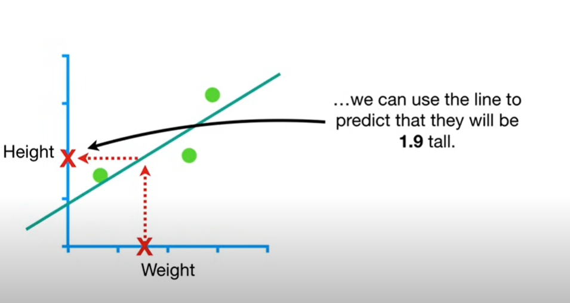

Lets start with a simple dataset
assume values of x and y to be 

                         x = [0.5 , 2.3 , 2.9 ]                         

                         y = [1.4 , 1.9 , 3.2 ]
                         
suppose the x-values to be the weight of individuals and y-values to be height                        

# 1. Hypothesis Function (The Line Equation)

The best fit line in simple linear regression is modeled as:

**ŷ = mx + c**  
or  
**ŷ = β₀ + β₁x**

Where:  
- **ŷ**: Predicted output  
- **x**: Input feature  
- **β₀**: Intercept (equivalent to c)  
- **β₁**: Slope (equivalent to m)

---
 

In multiple linear regression, the hypothesis function becomes:

**ŷ = β₀ + β₁x₁ + β₂x₂ + ⋯ + βₙxₙ**

# 2. Cost Function (Loss Function)

## In Simple Terms

In linear regression, the **loss function** (also called the cost function) is a formula used to measure how bad the model’s predictions are — essentially, how far off the predicted values are from the actual values in your dataset.

It tells us: **“How wrong is the model?”**

The goal of linear regression is to find the **line (model)** that minimizes this error — meaning it fits the data as closely as possible.

## Most Common Loss/Cost Function in Linear Regression

**Mean Squared Error (MSE):**

To measure how good the line is, we use **Mean Squared Error (MSE)**:

**MSE = (1/n) * Σᵢ=1ⁿ (yᵢ − ŷᵢ)²**

Where:

- **yᵢ** = Actual value  
- **ŷᵢ** = Predicted value from the line ŷ = β₀ + β₁x  
- **n** = Number of data points

     $$J(β₀, β₁) = (1/n) * Σᵢ=1ⁿ (yᵢ - ŷᵢ)² = (1/n) * Σᵢ=1ⁿ (yᵢ - (β₀ + β₁xᵢ))²$$

**Notation: `J(β₀, β₁)`**

- **`J`**: A conventional symbol commonly used to represent a cost or loss function.
- **`β₀`, `β₁`**: Model parameters (intercept and slope). These are inputs to the cost function, and the computed cost depends on their values.
  

**$$(1/n) * Σᵢ=1ⁿ (yᵢ - ŷᵢ)²$$**  this represents that the actual value of y minus the predicted value of y
,square it , do it for all values of acutal and predicted y, and then add them up. Now divide it by total 
number of y values which is labeled as n .

if we replace **ŷ** with **β₀ + β₁x** it becomes **$$(1/n) * Σᵢ=1ⁿ (yᵢ - (β₀ + β₁xᵢ))²$$**

This is  our cost function and our goal is to minimize this error.

---

## How It Works

1. For each point, calculate the difference between actual and predicted value:  
   **(yᵢ − ŷᵢ)**

2. Square that answer to:
   - Remove negative signs  
   - Penalize large errors more heavily

3. then add them up and divide the answer with total 
number of y values which is labeled as n  to get MSE — this is your **cost**.

---

---

## Why Square the Error?

- It emphasizes larger mistakes.
- Prevents positive and negative errors from canceling each other out.

---

## Goal in Linear Regression

Minimize the cost function (usually MSE) by adjusting:
- **β₀** = Intercept  
- **β₁** = Slope  

